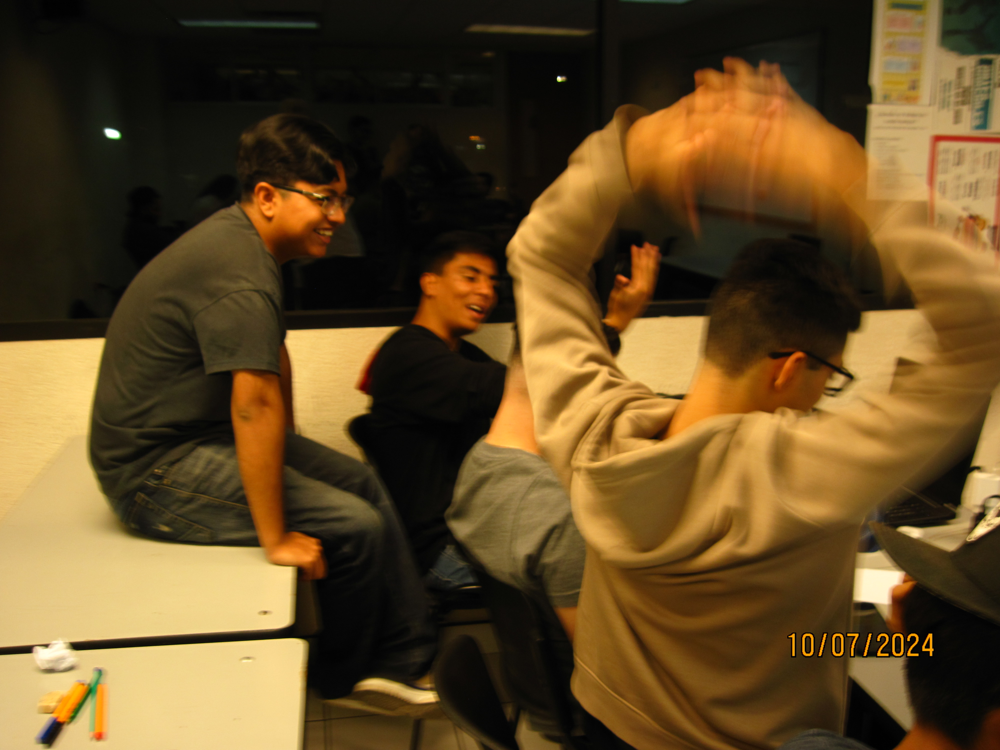
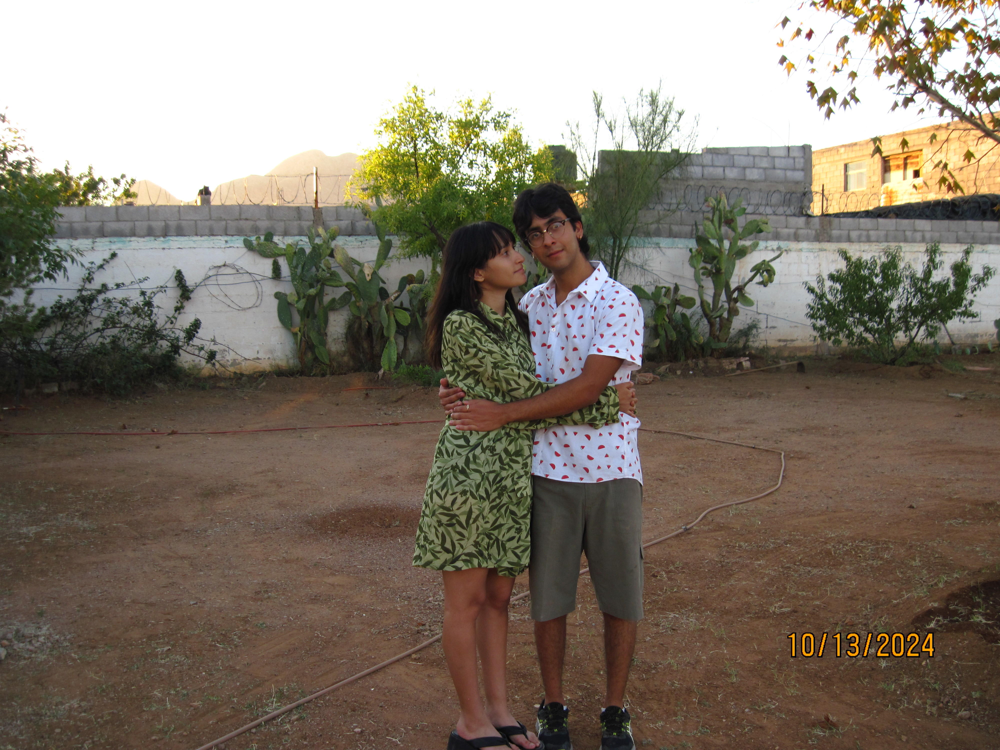

# Why is life so good?
Yeah, life can sometimes be hard, sad, and even bad, but in the end, I think it's pretty normal.
You won't always be happy or relaxed; sometimes you'll be so stressed, so sad, that you won't even want to get out of bed. Those moments can be negative or bad, but the magic happens when those moments go away. Because, just like good moments, bad moments are not eternal.

We always feel something, whether it's good or bad, but we do feel. However, I prefer to focus on the good things. Even though bad moments are important too, and they allow us to learn from mistakes, good moments are way better for me. I tend to be positive and thank God for the moments I have. They may be simple, but simple things are more enjoyable. You don't need to have all the pleasures in the world to have a good moment. If you would just take a bit of your time to think about how lucky you are to have such moments, you'd realize why they are so important and enjoyable.

Take this photo for example. For you, it may look like a simple classroom with a bunch of people, but for me, it's way more than that.
What I see is a classroom where I'm studying something I'm passionate about, a place where I've spent almost two and a half years, a classroom in a university where I've grown. I've learned so many things, not just academically, but life lessons too.
It's a place where I've had so much fun with friends, where I've eaten things I like, where I've met great people. And not only that—I also see people, but not just any people; they are friends who have been with me for some time. Friends I can talk to, friends who make me laugh even when I'm not at my best, friends I see almost every day, and friends I really hope will succeed in life.

I don't need to say much about this because I think the photo explains it by itself.
No expensive place, no fancy clothes, no alcohol—just a couple of teenagers spending their day together, making the effort to be there. But if you ask me, I see something only I can see. Why? Because I'm in love with her, and I can see all of her good and bad sides. I can see who she really is (Or that's what I think), and that makes me happy, because I never thought this moment would happen. It just did, and that's what makes it so special.

We sometimes worry about the future—if we'll still be together in a year, if I'll get this job in the next few months. We worry about so many things, but always remember:
*Tomorrow will be tomorrow. Today, and only today, is today.*