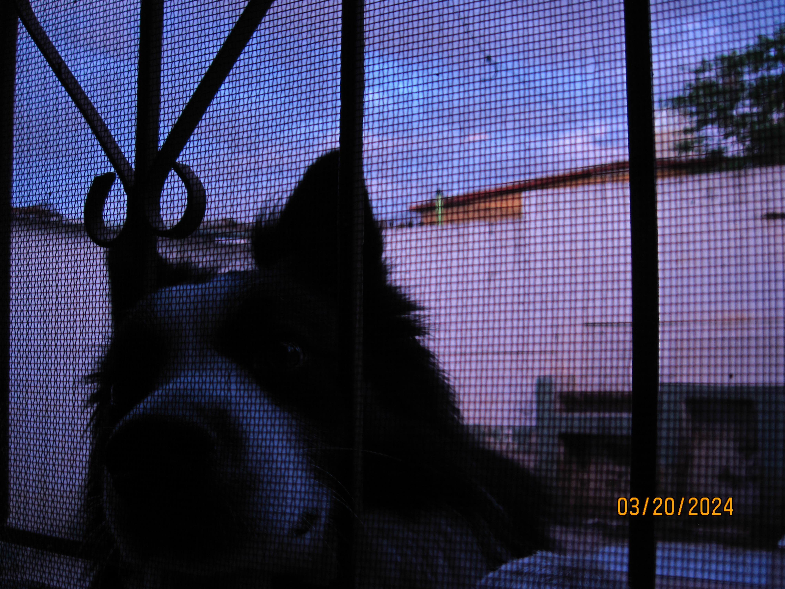

# Reflections on Creating a Minimalist Portfolio

I'm not a big fan of JavaScript, so it might seem odd that I built a web portfolio. Why did I do it then? The answer lies in my love for two seemingly disparate things: coding and minimalist art.

I've always seen a particular beauty in minimalist, dark, simple yet powerful software. This aesthetic reflects my design and development philosophy.

## The Developer's Portfolio Dilemma

As a programmer, I recognize the importance of having an online portfolio. However, not being a frontend developer, I didn't want to create a dazzling site full of animations and complex functionalities. That simply doesn't reflect my style or interests.

## A Minimalist Approach

Instead of aiming to create the most impressive portfolio in history, I drew inspiration from @vercel to design something minimalist. My portfolio focuses on the essentials:

- A welcome menu with a brief introduction
- My work experience
- A space for articles about my interests and creations
- An image gallery

### Why a Gallery?

The inclusion of a gallery section was a personal touch. I think it's cool to share positive photos of life, special moments with oneself, friends, and family. It's a way to add a human touch to a professional site.

## The Development Experience

Although frontend isn't my forte, I enjoyed working on this small, simple project. Using tools like [@Astro](https://astro.build/), [@Picocss](https://picocss.com/), and [@Vercel](https://vercel.com/) made the experience rewarding:

- **[@Astro](https://astro.build/)**: Offers an easy way to create simple websites. I like how it mixes script/html/style in a single .astro file, simplifying the work.
- **[@Picocss](https://picocss.com/)**: Provides minimalist and beautiful HTML elements, allowing me to focus on structure rather than styles.
- **[@Vercel](https://vercel.com/)**: My favorite platform for deploying sites. It's incredibly easy to use and requires minimal configuration.

## Final Thoughts

To everyone out there: put your hands to work and create your own portfolio. Believe me, it's fun. Put your soul into the work, and you'll see how your portfolio becomes a reflection of yourself.

